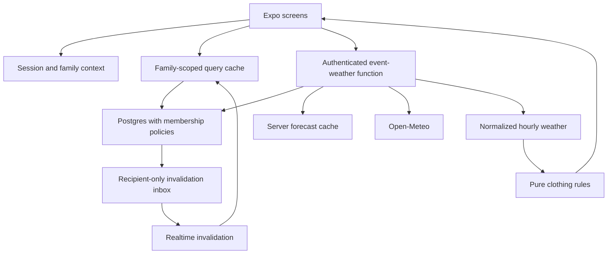
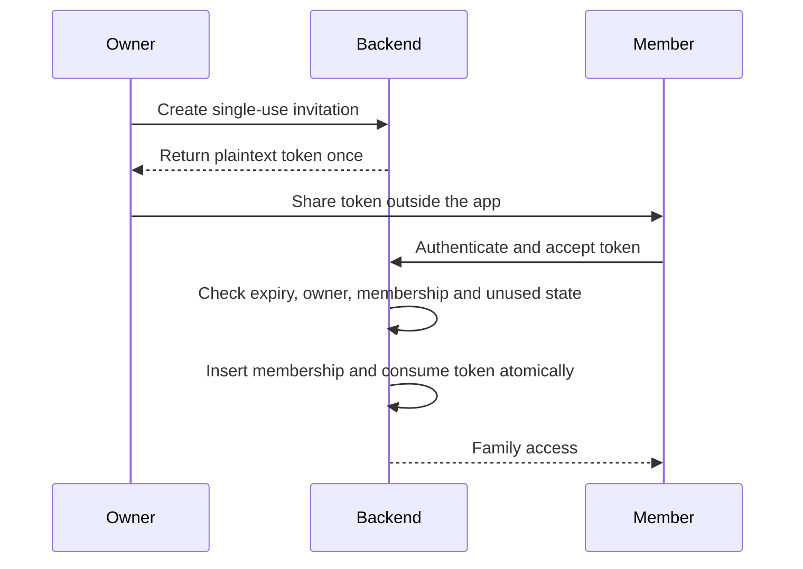
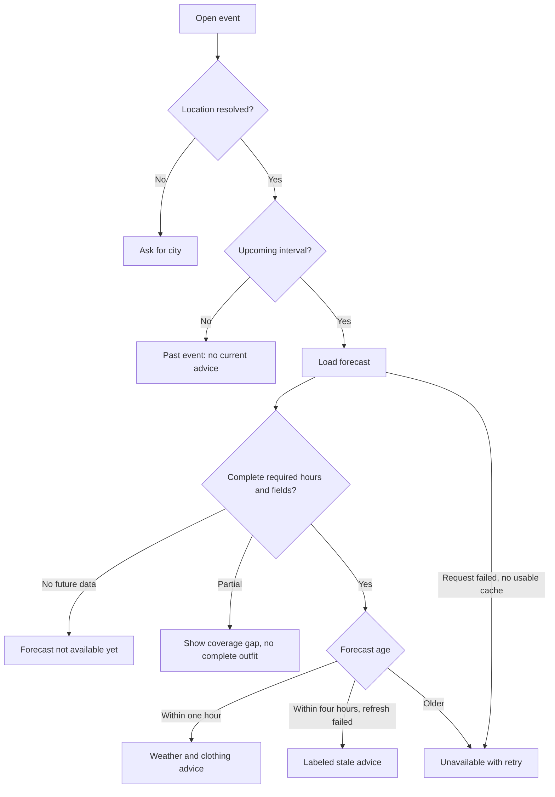

# Family Calendar and Weather Advice - Plan

## Goal Capsule

**Objective:** Family members can coordinate their upcoming events across their phones and decide what to wear for each outing's weather.

**Means:** Extend the existing Expo app with a private shared calendar, authenticated cloud persistence, and explainable clothing suggestions from hourly forecasts.

**Authority:** User decisions and repository instructions govern this plan. Product requirements govern behavior; technical decisions govern mechanisms within those requirements. Implementation units do not override either.

**Execution profile:** Implement and verify on iOS and Android. Keep the existing web entry compiling, without expanding this work into a desktop product. This document authorizes planning only; implementation begins on a subsequent instruction.

**Completion ownership:** The implementing agent completes the units, reviews changes, verifies the acceptance examples, and commits completed work under repository conventions. Publishing builds, provisioning paid services, and production deployment are separate release actions.

**Stop conditions:** Surface evidence that the agreed sharing or weather behavior cannot be delivered. Do not substitute a local-only demo for sharing, fabricated weather for unavailable forecasts, or client-side checks for authorization. Missing service configuration blocks connected verification, not development of the planned local boundaries.

---

## Product Contract

### Summary

Build a private family calendar with shared event editing and a weather-and-clothing panel on each event. Members can see the plan, understand the weather at the destination, and prepare before leaving.

### Problem Frame

Knowing that an event is scheduled does not tell a family member how to dress for it. They also need its destination, time of day, and expected conditions. The user wants that preparation within the family's shared schedule.

### Key Decisions

- **Private family schedule** (session-settled: user-directed - chosen over public event discovery: the user selected their family's own events). Governs R1, R4.
- **Sharing across phones** (session-settled: user-directed - chosen over a personal organizer: members should view and add events from their own devices). Governs R1, R2, R3, R5.
- **Practical clothing guidance:** recommend clothing categories with reasons, without a wardrobe catalog. Governs R8, R9; proposed default, not a user-settled preference.

### Actors

- A1. Family owner: creates the family, manages invitations and membership, and edits events.
- A2. Family member: joins by invitation, views and edits shared events, and uses clothing advice.

### Requirements

**Family access**

- R1. A signed-in user can create or join one private family calendar in the first version. A user outside that family cannot read its events, memberships, or invitations.
- R2. The owner can generate, revoke, and share a single-use invitation that expires after seven days. An authenticated recipient explicitly accepts it; invalid, expired, revoked, and already-used invitations grant no access.
- R3. Every member can create, edit, and delete family events. Only the owner manages membership; members may leave, and the owner must transfer ownership or delete the family before leaving. Account deletion is available in settings with the same ownership requirement.

**Calendar and events**

- R4. Provide a month calendar and selected-day agenda, plus create, detail, edit, and delete flows. Events have a title, start/end, event time zone, optional notes and venue label, and indoor/outdoor/mixed context. Support timed events and single-day all-day events; repetition and multi-day all-day events are deferred.
- R5. Committed changes become visible on another online member's phone without restarting the app. Show pending and failed saves honestly; a stale edit must not silently overwrite newer changes.
- R6. A city/locality selection supplies weather coordinates and its time zone; the venue label is separate. Events may be saved without a resolved location, but must then prompt for one instead of giving weather advice. Display event-local times and explicitly identify the time zone when it differs from the device's.

**Weather and clothing**

- R7. Forecasts describe the event location and relevant hours, never the phone's current location by default. Show feels-like range, precipitation probability, wind, source attribution, and retrieval time; label city-level coverage.
- R8. Display useful clothing categories: base layer, outer layer, footwear, and items to bring. Explain the weather reasons and use the full event interval; an all-day event uses 08:00-20:00 in its event time zone and labels that assumption.
- R9. Give distinct states for loading, missing location, forecast not yet available, partial coverage, stale data, and request failure. Do not produce a complete outfit from incomplete required forecast data. Past events show that current advice is unavailable.
- R10. Refresh on event-detail entry, pull-to-refresh, and app foreground when needed. Changing event location, time, or context invalidates the matching advice immediately; late responses for an older event version cannot replace current advice.

**Reliability and usability**

- R11. Previously loaded events remain visible during a connection interruption in the current session, with an offline label. Writes require a connection; preserve failed form input and offer retry. Clear family data on sign-out, membership loss, and account changes; no durable offline event storage is required initially.
- R12. Calendar navigation, event forms, and advice work with screen readers, large text, keyboard avoidance, light/dark themes, and touch targets of at least 44 points on iOS and 48 dp on Android. Never communicate membership, selection, or weather status through color alone.

### Key Flows

- F1. Create or join: authenticate, create a family or accept an invitation, and open its calendar. Covers R1-R3.
- F2. Plan an outing: choose a date, enter the event and city, save, and see it on a second member's phone. Covers R4-R6.
- F3. Prepare: open the event, inspect forecast and clothing advice, and refresh after schedule changes. Covers R7-R10.

### Acceptance Examples

- AE1. Two authenticated members in one family see a newly saved dinner on both phones; a user in another family cannot retrieve it even by event ID. Covers R1, R5.
- AE2. An outdoor event with a feels-like minimum of 9 C and rain probability of 80% recommends warm layers, a waterproof outer layer, and water-resistant footwear, with reasons. Covers R7, R8.
- AE3. An event sixty days away remains in the calendar and says the forecast is not available yet, without an invented outfit. Covers R4, R9.
- AE4. Moving an event to another city clears the old weather immediately; a delayed old response cannot restore it. Covers R6, R10.
- AE5. Two members edit the same event revision; the second save receives a conflict and retains its draft for reconciliation. Covers R5, R11.
- AE6. A member opens an event offline after viewing it online; the event remains visible, cached weather is labeled appropriately, and a failed edit keeps its input. Covers R9, R11.

### Scope Boundaries

The first release targets family members who manage their own accounts. It does not introduce child accounts or children's personal clothing profiles.

**Deferred for later:** recurring events, calendar imports and exports, reminders and push notifications, wardrobe photos, fashion matching, personal temperature preferences, multi-family switching, durable offline editing, and trip itineraries. These are proposed scope limits rather than choices explicitly made by the user.

**Outside this product's identity:** public event discovery, ticketing, shopping recommendations, and medical or protective-equipment guidance.

---

## Planning Contract

### Repository Grounding

`package.json` pins Expo `~58.0.0-preview.6`, Expo Router `~58.0.7`, React `19.3.0`, and React Native `0.88.0-rc.1`. `src/app/index.tsx` and `src/app/explore.tsx` are starter screens; `src/app/_layout.tsx` mounts shared theming and `AppTabs`. Native and web tabs have separate implementations in `src/components/app-tabs.tsx` and `src/components/app-tabs.web.tsx`.

`src/constants/theme.ts`, `src/components/themed-text.tsx`, and `src/components/themed-view.tsx` are reusable styling anchors. The repository has a tracked Bun lockfile, strict TypeScript, and a lint script, but no application backend, test suite, or test script. There are no tracked native project directories or existing product plans/learnings to extend.

### Assumptions

The user settled private events and cross-phone sharing. The remaining product defaults are explicit planning assumptions: one family per account, owner/member roles, email authentication, manual event entry, city-level weather, shared generic clothing advice, and the deferred scope above. These can be revised without treating them as user-approved requirements.

### Key Technical Decisions

- KTD1. **Retain Expo Router and the current SDK baseline.** Add a root stack with authentication, family setup, tabs, and event forms. Keep screens under `src/app/` and domain code outside it. Consult SDK 58 documentation and package exports before using APIs; do not combine this feature with an SDK migration. The preview baseline requires an early native smoke check. Implements R4, R12. [Expo SDK 58](https://docs.expo.dev/versions/v58.0.0/), [Router authentication](https://docs.expo.dev/router/advanced/authentication/).
- KTD2. **Use Supabase Auth, Postgres, and Realtime for family data.** Family membership is relational and should be enforced by database row-level security. Firebase is a viable alternative, but would require a different document/authorization model without an existing repo pattern to justify it. Client route guards are navigation only. Every table and privileged operation checks the authenticated user's live membership. Implements R1-R5. [Expo Supabase guide](https://docs.expo.dev/guides/using-supabase/), [Supabase row-level security](https://supabase.com/docs/guides/database/postgres/row-level-security).
- KTD3. **Authenticate with emailed one-time codes.** Enter codes in-app to avoid making account access depend on email deep links. Store session credentials with a SecureStore-backed adapter on native, handle storage errors without falling back to plaintext, and keep web sessions in memory for this mobile-first release. Validate session refresh, sign-out cleanup, and large session payloads on both platforms. Implements R1, R11. [Supabase email OTP](https://supabase.com/docs/guides/auth/auth-email-passwordless), [Expo SecureStore](https://docs.expo.dev/versions/v58.0.0/sdk/securestore/).
- KTD4. **Use transactional family operations and revision-checked event writes.** Family creation also creates its owner membership atomically. Store only hashed, cryptographically random invitation tokens; enforce single use, expiry, revocation, and one-family membership in a transaction. Invitations may be copied/shared manually; joining accepts a pasted code. Owner transfer, removal, family deletion, and account deletion are authorized server operations. Event creates use client-generated IDs for retry safety; edits/deletes require the revision read by the editor. Implements R2, R3, R5.
- KTD5. **Use Open-Meteo through authenticated backend functions.** A location-search function accepts bounded city queries; an event-weather function accepts an event ID and verifies membership before deriving its location. Send coordinates and forecast fields to the weather provider, never titles, notes, account IDs, or family names. Locality search is not address autocomplete. Keep provider-specific fields inside an adapter and check actual timestamp coverage rather than assuming every field reaches the maximum horizon. Implements R6-R10. [Forecast API](https://open-meteo.com/en/docs), [Geocoding API](https://open-meteo.com/en/docs/geocoding-api).
- KTD6. **Use a pure, deterministic clothing engine.** Normalize units to Celsius, km/h, and percent before applying rules. Base warmth on minimum apparent temperature: below 5 C, coat and warm layers; 5 to below 12 C, warm jacket; 12 to below 18 C, light jacket; 18 to below 25 C, light layers; 25 C or higher, breathable clothing. Add rain protection at probability at least 40% or precipitation at least 0.1 mm; use water-resistant footwear for rain and insulated footwear for subzero conditions. Wind at least 25 km/h adds a wind-resistant outer layer and avoids umbrella-first advice. Snow adds waterproof footwear with traction. Indoor events label recommendations as travel layers because indoor temperature is unknown. These are editable comfort heuristics, not safety guarantees. Implements R8; thresholds are proposed defaults.
- KTD7. **Preserve event time zones end to end.** Timed events store UTC instants plus an IANA zone; all-day events store a local date plus zone, never midnight UTC as a date surrogate. Use a maintained timezone-aware date library, selected after SDK compatibility inspection, for wall-time conversion. Reject nonexistent daylight-saving times and explicitly disambiguate repeated times. As a proposed editing default, changing the city to a different zone preserves the entered local clock values and all-day date, visibly identifies the new zone, and requires review before saving. Query weather with Unix timestamps and intersect hourly intervals with the event's instants, including overnight and multi-day timed events. Normalize each provider field's interval semantics, including precipitation reported for the preceding hour, before matching it to an event. Aggregate minimum/maximum apparent temperature and maximum precipitation/wind over covered hours. Implements R4, R6-R9.
- KTD8. **Keep synchronization separate from the UI.** Use TanStack Query for in-memory server-state caching, invalidation, and reconnect/foreground refetch. Scope all keys by authenticated user and family. Publish only INSERT notifications from a per-user invalidation inbox protected by recipient-only read policies; raw family, event, membership, and invitation tables stay out of the Realtime publication. Event mutations transactionally add content-free refresh hints for current members; removal adds a revocation hint for the affected user. Clients cannot write inbox records. Realtime is not the sole correctness mechanism: refetch the user's own membership after subscribing, reconnecting, and foregrounding, and treat a missing membership row as revocation even if the query succeeded. Clear the family cache and subscriptions before routing to setup. Do not persist event queries to disk initially. Implements R5, R10, R11. [TanStack React Native guidance](https://tanstack.com/query/latest/docs/framework/react/react-native), [Supabase change notifications](https://supabase.com/docs/guides/realtime/postgres-changes#receiving-old-records).
- KTD9. **Bound forecast caching and failure behavior.** Cache normalized forecasts server-side by city coordinates, requested coverage, and provider schema version, with a one-hour freshness period. During a provider failure, previously complete forecasts up to four hours old may be shown with a stale label; older forecasts cannot drive advice. Re-check coverage against the edited event. An eight-second timeout and at most one retry for transient failures bound detail loading. Rate-limit authenticated location/forecast requests and impose input/result limits. Unavailable fields remain missing, never zero. Implements R7, R9, R10.

### Data Boundaries

Proposed entities are `families`, `family_members`, `family_invitations`, and `events`, with server-only forecast cache and request-limit records. The recipient-scoped `invalidation_inbox` carries the signals defined in KTD8; prune old hints server-side because reconnect always reconciles authoritative state. Events reference a family, creator, revision, time representation, location, and context. User display names are visible only through shared-family membership; do not create a globally readable profile directory.

Database constraints enforce membership uniqueness, valid intervals, and event-family references. Membership grants and owner changes are unavailable as direct client writes. Any elevated database function has a fixed search path, narrow execution grants, and explicit authorization; avoid recursive membership policies. All sensitive mutations recheck authorization inside their transaction. Users cannot choose a different family by altering an event update payload.

Account deletion removes credentials and membership through a server operation; shared event authorship becomes a neutral former-member attribution. Family deletion removes its events and pending invitations after confirmation. Credentials, invitation tokens, event content, and location queries are excluded from application logs.

### High-Level Technical Design

### Risks and Prerequisites

- Supabase project credentials and email delivery configuration are needed for connected verification. Keep publishable configuration separate from server secrets; no service-role key belongs in the app. A local Supabase environment can prove access rules before hosted credentials exist.
- Confirm the selected Open-Meteo usage tier permits the intended deployment and supply required attribution. Do not assume an unrestricted free production service. External account creation or paid subscription is not part of this planning task.
- SDK preview compatibility is an execution-time risk. Smoke-test authentication storage, native forms, and routing before building the full UI; resolve a concrete compatibility failure without quietly changing the SDK baseline.
- City-level forecasts do not capture every venue's microclimate. R7 labels the approximation, and R9 prevents unsupported certainty for distant dates or incomplete intervals.
- A disconnected member can retain already displayed information until the app reconnects. The server denies subsequent access immediately after removal; the app clears cached information when it learns of removal. Do not promise remote erasure from an offline device.

---

## Implementation Units

### U1. Establish authenticated navigation and test foundations

**Goal:** Provide a working session boundary and navigable mobile shell.

**Requirements:** R1, R11, R12. **Dependencies:** None.

**Files:** `src/app/_layout.tsx`, `src/app/(auth)/sign-in.tsx`, `src/app/(auth)/verify.tsx`, `src/app/(tabs)/_layout.tsx`, `src/lib/supabase.ts`, `src/lib/session-storage.ts`, `src/providers/session-provider.tsx`, `src/components/app-tabs.tsx`, `src/components/app-tabs.web.tsx`, `src/providers/__tests__/session-provider.test.tsx`, `src/lib/__tests__/session-storage.test.ts`, `jest.config.js`, `package.json`, `app.json`, `.env.example`.

**Approach:** Implement KTD1-KTD3 and the cache-clearing boundary in KTD8. Establish Expo-compatible Jest and React Native Testing Library tooling through Bun and Expo's compatible dependency installer. Retain shared theme primitives. Prefer existing `@expo/ui` controls where the SDK 58 API supports both target platforms; do not assume web parity for native-only controls.

**Execution note:** Prove a native sign-in/restore/sign-out round trip before building dependent screens.

**Test scenarios:**

1. A valid code starts a session; an expired or invalid code keeps the user signed out with retry guidance.
2. Restoring a session does not flash private routes; a failed refresh returns to sign-in.
3. Sign-out and account switching remove cached family state and credentials.
4. Storage rejection, including a large session payload, does not silently drop into insecure storage.

**Verification:** Authentication works on iOS and Android; protected screens cannot be entered while signed out. Existing theme and web compilation remain functional.

### U2. Build family authorization and invitations

**Goal:** Make family membership a tested server-side boundary.

**Requirements:** R1-R3, F1. **Dependencies:** U1.

**Files:** `supabase/config.toml`, `supabase/migrations/<timestamp>_families_and_membership.sql`, `supabase/tests/database/family_access.test.sql`, `supabase/functions/delete-account/index.ts`, `supabase/functions/delete-account/index.test.ts`, `src/features/family/api.ts`, `src/app/family-setup.tsx`, `src/app/(tabs)/family.tsx`, `src/features/family/__tests__/membership.test.ts`.

**Approach:** Implement KTD2 and KTD4, including owner transfer and account lifecycle. Resolve membership through the authenticated identity. Family creation grants its creator the initial owner role atomically; other operations cannot permit unauthorized self-promotion or bypass authorized ownership transfer. Use an idempotent account-deletion workflow so interrupted cleanup can resume without orphaning owned families.

**Test scenarios:**

1. Creating a family creates exactly one owner membership, including a retried request.
2. Two users accept one invitation concurrently; exactly one joins.
3. Expired, revoked, reused, and invalid invitations reveal no family data and grant no membership.
4. A member cannot promote themselves, remove the owner, or access another family's records through direct requests.
5. Removing a member denies subsequent data access; owner transfer and leave preserve a valid owner.
6. Deleting an account removes credentials and membership after satisfying the ownership requirement. Verify preservation of shared events in U3, after those records exist.

**Verification:** Database and authenticated-function tests exercise real authorization contexts, including outsider and removed-member requests.

### U3. Implement shared event storage and synchronization

**Goal:** Persist valid events and synchronize edits without silent data loss.

**Requirements:** R4-R6, R10, R11, F2. **Dependencies:** U2.

**Files:** `supabase/migrations/<timestamp>_events.sql`, `supabase/migrations/<timestamp>_invalidation_inbox.sql`, `supabase/tests/database/events.test.sql`, `supabase/tests/database/invalidation_access.test.sql`, `supabase/functions/delete-account/index.ts`, `supabase/functions/delete-account/index.test.ts`, `src/features/events/types.ts`, `src/features/events/api.ts`, `src/features/events/queries.ts`, `src/features/events/event-time.ts`, `src/features/events/__tests__/event-time.test.ts`, `src/features/events/__tests__/event-sync.test.ts`, `src/providers/query-provider.tsx`.

**Approach:** Implement KTD4, KTD7, and KTD8. Make shared mutations revision-aware and scope subscriptions and cache keys by identity. Query calendar intervals using overlap, including events that started before the visible day. Keep all-day dates distinct from instants.

**Test scenarios:**

1. Covers AE1. Creation reaches another family member while a different family cannot read or mutate the event.
2. Covers AE5. Stale update/delete requests return conflicts; draft input survives.
3. Retrying an uncertain create does not duplicate the event.
4. DST gaps and repeated hours, overnight events, and all-day events preserve the intended event-local date/time.
5. Subscription reconnect and foreground refetch recover a missed event change.
6. A former family subscription cannot populate the current user's cache.
7. An outsider listening during event deletion receives no record or invalidation hint; an already-connected removed member receives revocation and clears the family cache. A missed revocation is detected by membership reconciliation on reconnect.
8. Account deletion preserves the former member's shared events with neutral authorship, completing the lifecycle integration introduced in U2.

**Verification:** Real backend integration proves sharing and isolation; pure time tests cover timezone boundaries without device-clock dependence.

### U4. Build the calendar and event editing experience

**Goal:** Make the shared schedule usable on phones.

**Requirements:** R4-R6, R11, R12, F2. **Dependencies:** U3.

**Files:** move `src/app/index.tsx` to `src/app/(tabs)/index.tsx`; replace `src/app/explore.tsx`; add `src/app/events/new.tsx`, `src/app/events/[id]/index.tsx`, `src/app/events/[id]/edit.tsx`, `src/features/calendar/calendar-month.tsx`, `src/features/calendar/day-agenda.tsx`, `src/features/events/event-form.tsx`, `src/features/events/__tests__/event-form.test.tsx`, `src/features/calendar/__tests__/calendar-month.test.tsx`.

**Approach:** Use a bounded accessible month grid and virtualized agenda. Make selection and event presence explicit in accessibility labels. Keep the event form available when city search or weather fails. Implement a deletion confirmation and a conflict view that offers reload while preserving the user's draft. Follow existing spacing/color tokens; remove obsolete starter navigation.

**Test scenarios:**

1. Selecting a date shows its agenda; an empty date offers event creation with that date prefilled.
2. Invalid intervals cannot save; server failures retain all entered fields.
3. Overnight events appear on both overlapping dates; single-day all-day events do not shift when the device zone changes.
4. Large text, screen-reader focus, keyboard display, and dark mode preserve access to every form action.
5. Covers AE6. An interrupted connection shows cached events and prevents false save success.

**Verification:** Complete create/edit/delete flows on both platforms, with targeted visual inspection for clipping and spacing.

### U5. Integrate locality search and hourly weather

**Goal:** Deliver authorized forecasts with truthful coverage and failure states.

**Requirements:** R6, R7, R9, R10, F3. **Dependencies:** U3, U4.

**Files:** `supabase/functions/location-search/index.ts`, `supabase/functions/event-weather/index.ts`, `supabase/functions/_shared/weather-provider.ts`, `supabase/migrations/<timestamp>_weather_cache.sql`, `supabase/functions/event-weather/index.test.ts`, `supabase/functions/location-search/index.test.ts`, `src/features/weather/types.ts`, `src/features/weather/queries.ts`, `src/features/events/location-field.tsx`, `src/features/events/event-form.tsx`, `src/features/events/__tests__/event-form.test.tsx`, `src/features/weather/__tests__/coverage.test.ts`.

**Approach:** Implement KTD5, KTD7, and KTD9. Authenticate each function, validate coordinates/time zones and provider responses, and isolate cache storage from clients. Disambiguate cities by region and country. Wire the location field into U4 after both units exist.

**Test scenarios:**

1. Two cities with the same name show region/country and persist the selected result's zone/coordinates.
2. Covers AE3. An out-of-horizon event returns unavailable rather than using today's forecast.
3. Missing apparent temperature, precipitation, or wind for required hours returns partial coverage without treating null as zero.
4. Covers AE4. Changing location/time prevents a delayed response from being applied to the new event revision.
5. Unauthorized IDs, malformed queries, rate limits, provider timeouts, and malformed provider data return bounded errors without leaking event contents.
6. Complete cached forecasts obey freshness and stale cutoffs; cache access still requires live family authorization.
7. Changing an 18:00 New York event to Los Angeles in the form retains 18:00, shows the new zone for review before saving, and persists the selected city's coordinates and recalculated instant. Daylight-saving validation runs again; all-day dates remain unchanged. Covers KTD7.

**Verification:** Contract fixtures cover provider edge cases, and a live smoke request verifies real response units, timestamps, and attribution separately from deterministic tests.

### U6. Add explainable clothing recommendations

**Goal:** Turn complete forecasts into useful preparation advice.

**Requirements:** R8-R10, R12, F3. **Dependencies:** U4, U5.

**Files:** `src/features/outfits/recommend.ts`, `src/features/outfits/rules.ts`, `src/features/outfits/outfit-card.tsx`, `src/features/outfits/__tests__/recommend.test.ts`, `src/features/outfits/__tests__/outfit-card.test.tsx`, `src/features/weather/weather-card.tsx`, `src/app/events/[id]/index.tsx`.

**Approach:** Implement KTD6 as a pure function over normalized forecast summaries and event context. Separate rule selection from presentation and attach human-readable reasons. Compose competing rules into one outfit rather than stacking contradictory recommendations. Route partial/unavailable inputs through R9 before rule evaluation.

**Test scenarios:**

1. Covers AE2. A 9 C rainy outdoor outing produces warm waterproof layers and appropriate footwear with reasons.
2. Values exactly at every temperature, rain, and wind boundary choose the documented side of the threshold.
3. Warm rain adds lightweight waterproof protection without a winter coat; strong wind removes umbrella-first advice.
4. Indoor context identifies travel layers and does not claim the indoor temperature is known.
5. Partial coverage, stale data beyond the cutoff, and missing location never render a fresh complete outfit.
6. Changing event context recomputes advice even if the underlying forecast remains cached.

**Verification:** Rules pass a compact matrix of weather fixtures; users can understand each recommendation without reading technical weather fields.

### U7. Prove cross-device journeys and prepare internal delivery

**Goal:** Verify the complete family experience against real service boundaries.

**Requirements:** R1-R12, F1-F3, AE1-AE6. **Dependencies:** U1-U6.

**Files:** `qa/flows/family-sharing.yaml`, `qa/flows/weather-advice.yaml`, `qa/flows/session-and-offline.yaml`, `docs/testing/family-calendar.md`, `docs/operations/family-calendar.md`, `README.md`, `eas.json`.

**Approach:** Create repeatable Argent flows and isolated seeded test families. Extend the existing simulator-only EAS setup with internal iOS/Android delivery profiles when implementation reaches that stage. Document service configuration, migrations, provider attribution, rollback, and smoke checks. Record error categories and provider latency without logging event content or tokens.

**Test scenarios:**

1. Two member sessions and one outsider complete AE1 and AE5 against the backend.
2. Repeat AE2-AE4 with controlled forecasts, then verify a real weather response separately.
3. Exercise AE6, session expiry, member removal, and account switching without leaked cached data.
4. Run the principal journeys on iOS and Android; inspect calendar, long event names, form errors, and every weather state at large text sizes.

**Verification:** The Verification Contract passes and evidence records device/platform, fixture, result, and any residual limitation.

---

## Verification Contract

These gates apply during implementation, not during this document-only planning task.

| Gate | Evidence | Required result |
|---|---|---|
| Static checks | `bun run lint` and `bunx tsc --noEmit` | No errors in the changed project |
| Dependency compatibility | `bunx expo-doctor` and native smoke checks | SDK-compatible dependencies and working navigation/forms/storage |
| Unit and component behavior | Expo-compatible Jest script added in U1, invoked through Bun | Time conversion, form, session, coverage, and clothing scenarios pass |
| Database authorization | Supabase database tests under authenticated user contexts | Outsiders and removed members cannot access data; invitation and write races are handled |
| Backend functions | Function contract/integration tests named in U2 and U5 | Authentication, validation, cache, retry, and provider errors match the requirements |
| Mobile journeys | Argent flows and two independent authenticated clients | AE1-AE6 work on iOS and Android with real sharing |
| Visual/accessibility | Targeted screenshots, trees, and screen-reader checks | R12 passes without clipping, hidden actions, or color-only state |
| Provider smoke | One real location and forecast response in a test environment | Correct place, hours, units, source, and coverage |

Prefer UI trees over screenshots, batch interactions, and await state rather than polling. Routine visual checks use screenshot scale 0.2; full-resolution evidence is saved without loading it into context. Auto-screenshots remain disabled. No screen recording is needed unless a motion defect requires it.

No existing test or release-validation script is assumed. U1 establishes the application test harness; U7 documents the exact function/database commands supported by the chosen tooling. Never report fixture-only weather tests as proof of provider integration or mocked membership tests as proof of database isolation.

---

## Definition of Done

- Each unit meets its verification outcome and the implementation covers every requirement and acceptance example.
- Two family members can coordinate events across devices, while another family cannot access their data.
- Event weather and clothing advice use the destination and event hours and visibly distinguish unsupported, partial, and stale forecasts.
- Static checks, targeted tests, real backend integration, and iOS/Android journeys pass with recorded evidence.
- Setup and operations documentation lets another developer configure the services without private credentials in source control.
- Remove obsolete starter routes and any abandoned experimental implementation; preserve unrelated user work and generated files.
- Completed implementation work is reviewed and committed. Any release provisioning or production action still required is reported explicitly rather than presented as shipped.

---

## Sources

- Local architecture: `package.json`, `app.json`, `eas.json`, `tsconfig.json`, `src/app/_layout.tsx`, `src/components/app-tabs.tsx`, `src/components/app-tabs.web.tsx`, `src/constants/theme.ts`.
- [Expo documentation index](https://docs.expo.dev/llms.txt), [SDK 58](https://docs.expo.dev/versions/v58.0.0/), and [Expo UI](https://docs.expo.dev/versions/v58.0.0/sdk/ui/) constrain framework and native-control choices.
- Backend, authentication, weather, and caching sources are linked at their owning technical decisions; recheck service terms and SDK compatibility before connected implementation.
